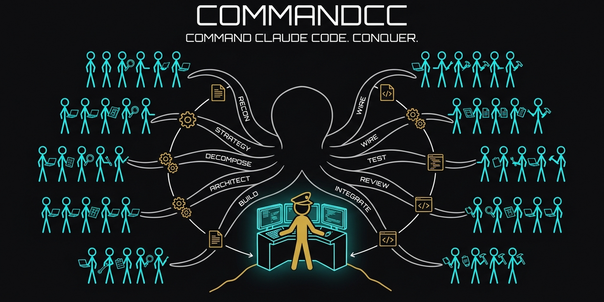

# CommandCC



**Command Claude Code. Conquer.**

Deploy 4 to 260 AI agents in parallel waves from a single terminal. You type objectives. The system deploys a coordinated fleet. You read the battle map when it's done.

---

## Quick Start (No Installation Required)

You do not need to clone this repo or install anything. Paste this prompt into any Claude Code instance:

```
You are now a CASCADE orchestrator. You run 4-agent waves in parallel.
Each wave has 4 subagents launched in ONE message via the Agent tool:
- cascade-alpha (opus): reviews previous wave + hardest current task
- cascade-bravo (sonnet): medium task
- cascade-charlie (haiku): bulk/repetitive grunt work
- cascade-delta (sonnet): verification and testing

Calculate wave count before starting:
- ~1 hour of serial work = 3 waves (12 agents)
- ~2 hours = 4 waves (16 agents)
- ~3+ hours = 5-6 waves (20-24 agents)

For each wave: think deeply, decompose into 4 independent subtasks
with zero file overlap, launch all 4 in ONE message, wait for all to
complete, assess results, plan next wave. After final wave, produce
BATTLE-MAP.md with results.

Rules: no paid plugins or services without asking the operator.
No em-dashes. Linux native tooling only. If scope has a gap, halt
and ask the operator. You are not alone, the operator is watching.

Now execute this objective: [YOUR OBJECTIVE HERE]
```

Replace `[YOUR OBJECTIVE HERE]` with what you want built. That is it. No repo clone, no npm install, no configuration.

---

## Full Bootstrap (For Persistent Setup)

If you want the agents and slash commands installed permanently so you can run `/cascade [objective]` as a command:

### Step 1: Create a sudo-claude user (one time per server)

Each CC wave instance needs its own user. Create a passwordless sudo user:

```bash
sudo adduser --disabled-password --gecos "" sudo-claude
sudo usermod -aG sudo sudo-claude
echo "sudo-claude ALL=(ALL) NOPASSWD:ALL" | sudo tee /etc/sudoers.d/sudo-claude
su - sudo-claude
```

### Step 2: Install the bootstrap

```bash
curl -s https://commandcc.ai/install.sh | bash
```

This writes 7 agent definitions + 2 slash commands + fleet doctrine to `.claude/agents/` and `.claude/commands/`. No npm, no node_modules, no dependencies.

### Step 3: Run

```bash
claude
```

Then:

```
/cascade Deploy user authentication, payment processing, and admin dashboard
```

Or for topic-specialized cascades:

```
/cascade-fe Rebuild the landing page in brutalist BW theme
/cascade-eng Migrate the API from Express to Fastify
/cascade-mkt Write launch copy for the new product line
```

---

## How It Works

### The Cascade Pattern

You are Opus with extended thinking. You run waves. Each wave spawns 4 subagents in parallel. Each successive wave's alpha (Opus) reviews the previous wave before adding its own work. No separate looper. You close the operation yourself.

```
Wave 1:  alpha(opus) + bravo(sonnet) + charlie(haiku) + delta(sonnet)  -> results
                                                                           |
Wave 2:  alpha reviews wave 1, then all 4 execute new tasks in parallel -> results
                                                                           |
Wave 3:  alpha reviews wave 2, then all 4 execute final tasks          -> BATTLE-MAP.md
```

### Model Assignment

```
[haiku, opus-ext, sonnet, haiku, haiku, sonnet, opus]
 RECON   THINK    COMPLEX  GRUNT   GRUNT   CHECK   CLOSE
```

| Position | Model | Role |
|---|---|---|
| Scout | Haiku | Fast recon, codebase scan |
| Orchestrator | Opus (extended thinking) | Deep decomposition, wave planning |
| Worker 1 | Sonnet | Complex code, architecture changes |
| Worker 2 | Haiku | Bulk ops, pattern application, grunt |
| Worker 3 | Haiku | Tests, boilerplate, renames, grunt |
| Reviewer | Sonnet | Quality gate (PASS / NEEDS CHANGES) |
| Looper | Opus | Convergence, test runs, BATTLE-MAP |

### Wave Count Formula

| Serial work estimate | Waves | Total agents |
|---|---|---|
| ~1 hour | 3 | 12 |
| ~1.5-2 hours | 4 | 16 |
| ~2-3 hours | 5 | 20 |
| ~3+ hours | 6 (max) | 24 |

---

## Fleet Doctrine (Section 0)

These 8 rules apply to every CC running this system. Every subagent must be briefed with them.

```
1. Linux/Unix native only. No paid plugins, no vendor CLIs.
2. Certs: Let's Encrypt + certbot + HTTP-01 webroot.
3. Registrar is display-only. Any DNS touch -> ASK OPERATOR.
4. Any paid-service, account, API key, billing -> ASK OPERATOR.
5. Distribution: GitHub free tier, public PyPI only.
6. Infra is cattle not pets. Disposable droplets.
7. Grep a fleet peer before improvising on uncovered scope.
8. Operator is watching. Halt on gaps. Never assume autonomy.
```

**The human-gate principle:** anything that costs money, touches an external account, or changes DNS is human-gated. CC autonomy applies elsewhere.

Full doctrine with rationale for each rule: [commandcc.ai/cascade.md](https://commandcc.ai/cascade.md)

---

## Topic-Specialized Cascades

For heavier operations, install topic-specialized agent rosters:

```bash
curl -s https://commandcc.ai/cascade-topics.md -o /tmp/cascade-topics.md
# Then tell CC: Read /tmp/cascade-topics.md and execute Part 1
```

This installs 12 additional agents across 3 topics:

| Command | Team | Use When |
|---|---|---|
| `/cascade` | Generic 4-agent base | Unknown topic, exploratory |
| `/cascade-fe` | UX + components + CSS + a11y QA | Frontend builds |
| `/cascade-eng` | Architecture + implementation + cleanup + tests | Backend, API, refactoring |
| `/cascade-mkt` | Strategy + copy + assets + brand QA | Content, positioning, campaigns |

---

## Scaling: Agent Teams (Experimental)

For operations that need more than 10 parallel agents, Claude Code's Agent Teams feature lets you spawn separate CC sessions as teammates:

```bash
# Launch with Agent Teams enabled
CLAUDE_CODE_EXPERIMENTAL_AGENT_TEAMS=1 claude --dangerously-skip-permissions
```

Then run `/thunderblitz [objective]` to deploy 6 CC operator teammates (CC-ALPHA through CC-FOXTROT), each running their own internal cascade with up to 10 subagents. Maximum: 60 agents from one terminal.

**Note:** Agent Teams is experimental. The flag must be set BEFORE launching Claude Code, it cannot be set mid-session. The standard `/cascade` command works without it.

---

## Bootstrap URLs

All bootstraps embed Section 0 fleet doctrine. Any CC that fetches any of these gets the 8 rules in its first-boot context.

| URL | What | Restart needed? |
|---|---|---|
| [commandcc.ai/cascade.md](https://commandcc.ai/cascade.md) | Cascade pattern + Section 0 doctrine + 4-agent base | No |
| [commandcc.ai/cascade-topics.md](https://commandcc.ai/cascade-topics.md) | Frontend + engineering + marketing specialists | No |
| [commandcc.ai/thunderwave.md](https://commandcc.ai/thunderwave.md) | 3-wave x 4-agent time-boxed variant | No |
| [commandcc.ai/self-bootstrap-thunderblitz.md](https://commandcc.ai/self-bootstrap-thunderblitz.md) | 7-agent pipeline + Agent Teams teammate definition | Agent Teams needs restart |
| [commandcc.ai/install.sh](https://commandcc.ai/install.sh) | Bash installer, writes all agent files + commands | No |

---

## The Proof: OPERATION OPBLITZ3

The first field deployment. One operator typed four objectives. The system deployed 16 agents across 4 phases.

| Metric | Value |
|---|---|
| Human input | 4 sentences |
| Agents deployed | 16 |
| Features implemented | 4 |
| Tests written | 131 |
| Tests passing | 131 |
| Wall clock time | 13 minutes |
| Cognitive load compression | 200x |

See [BATTLE-MAP-OPBLITZ3.md](./BATTLE-MAP-OPBLITZ3.md) for the full record.

---

## Architecture

```
SUPREME COMMAND (human operator)
       |
ORCHESTRATOR (opus, extended thinking, this CC instance)
       |
   WAVES of 4 subagents (launched in parallel per wave)
       |
   cascade-alpha (opus)     - reviews previous wave + hardest task
   cascade-bravo (sonnet)   - medium task
   cascade-charlie (haiku)  - bulk grunt
   cascade-delta (sonnet)   - verification
       |
   BATTLE-MAP.md (orchestrator closes, no separate looper)
```

For Agent Teams scaling:

```
SUPREME COMMAND (human operator)
       |
TEAM LEAD (this CC instance)
       |
CC-ALPHA  CC-BRAVO  CC-CHARLIE  CC-DELTA  CC-ECHO  CC-FOXTROT
  |          |          |          |          |          |
own cascade pipeline with own subagents internally
```

---

## C2 Server (Multi-Server Fleet)

For cross-server fleet deployments, the C2 server acts as a REST message bus. Orders flow DOWN, reports flow UP, handoffs flow LATERAL.

See [docs/c2-setup.md](./docs/c2-setup.md) for installation.

---

## Go Deeper

| Document | What |
|---|---|
| [commandcc.ai](https://commandcc.ai) | Product landing page |
| [commandcc.ai/cascade.md](https://commandcc.ai/cascade.md) | Full cascade doctrine with Section 0 |
| [commandcc.ai/paper.html](https://commandcc.ai/paper.html) | How it works, visual explainer |
| [docs/getting-started.md](./docs/getting-started.md) | Step-by-step setup |
| [docs/writing-operations.md](./docs/writing-operations.md) | Custom operations |
| [docs/writing-agents.md](./docs/writing-agents.md) | Custom agents |
| [doctrine/](./doctrine/) | Chain of command, wave structure, message types |
| [WHITEPAPER.md](./WHITEPAPER.md) | Academic paper on quantumized execution |

---

## License

Apache 2.0. See [LICENSE](./LICENSE).

---

*Built by [AXL Protocol](https://axlprotocol.org). CommandCC built itself using its own pattern.*
